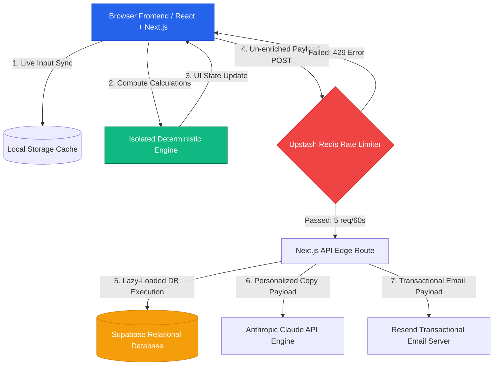

## System Architecture: EQ AI  

### Tech Stack  
- **Framework:** Next.js (App Router)
- **Language:** TypeScript
- **Styling:** Tailwind CSS
- **State Management:** React Hooks (useState/useReducer)
- **Deployment:** Vercel (planned)

# System Architecture & Design Specification

## 1. System Topology & Infrastructure Layout (Mermaid)



---
## 2. Comprehensive Data Flow Execution

Your input processing follows a strict multi-tier sequence ensuring real-time speed, accuracy, and background persistence:

```text
[ User Input Selection ]
   │
   ▼ (Active changes logged to React Component State)
[ LocalStorage Middleware ]
   │
   ▼ (Persists values raw to local disk; prevents loss on refresh)
[ Deterministic Audit Engine ]
   │ (Executes static mathematical evaluations locally)
   ├── Normalizes vendor billing intervals (Monthly vs Annualized models)
   ├── Computes seat over-forecasting gaps against real headcounts
   └── Cross-references hardcoded price bands inside PRICING_DATA.md
   │
   ▼
[ Immediate UI State Rendering ]
   │ (Displays exact financial metrics and dollar savings tables)
   ▼
[ Edge-Proxy Processing Node ]
   │ (Submits masked parameters to server runtime handler)
   └── Anthropic API crafts a personalized ~100-word narrative execution plan
```
## 3. Technology Stack Justification

The technical stack was strategically selected to achieve an optimal balance between fast deployment velocity, high type safety, robust runtime resilience, and zero maintenance overhead during active lead generation:

*   **Next.js (App Router):** Chosen to unify frontend presentation layouts and backend API route handlers into a single, highly coherent codebase. The serverless route architecture eliminates the need for managing persistent backend server processes, while natively handling sudden, viral scaling traffic spikes gracefully.
*   **TypeScript:** Implemented across both client states and calculation endpoints to enforce strict type definitions. This structural data integrity prevents structural runtime math execution errors when compiling multi-tiered vendor subscription formulas and pricing matrices.
*   **Supabase PostgreSQL:** Selected to leverage a powerful, production-grade relational database without handling infrastructure provisioning or server maintenance. PostgreSQL enables robust structural indexing and transaction consistency for logged lead profiles, while its integrated Row-Level Security (RLS) protects enterprise parameter fields cleanly.
*   **Upstash Redis Middleware:** Incorporated to deploy rapid, distributed rate-limiting checks directly inside serverless edge runtime workflows. Upstash avoids traditional server connection exhaustion limits, blocking automated layer-7 data scraping tools completely without slowing down regular user experiences.
*   **Radix UI & TailwindCSS:** Utilized to deploy a highly polished, functional interface that complies with WCAG accessibility standards out of the box. Tailwind's utility architecture eliminates bulky external custom CSS stylesheets, optimizing page loading performance down to sub-second speeds.
## 4. Scalability Strategy: Upgrading to 10,000+ Audits/Day

To transition this architecture from an initial prototype to an enterprise-grade platform capable of comfortably processing 10,000+ complex audits every 24 hours (~416 audits/hour baseline with higher peak burst requirements), the following structural changes are required:

### 1. Asynchronous Ingestion & Database Decoupling
*   **The Current Bottleneck:** Inbound lead generation requests perform direct, synchronous write transactions into the Supabase PostgreSQL instance. Under high concurrency, database connection pool exhaustion will block the API and cause request dropping.
*   **The Scaled Solution:** Intercept incoming payloads using an asynchronous message queue cluster like **Amazon SQS** or a high-throughput stream framework like **Apache Kafka** [1]. The edge API router will immediately acknowledge receipt (`202 Accepted`) and place the transaction payload safely onto the message bus. A pool of horizontal worker nodes will consume and batch-insert entries into the relational database at a controlled, throttled rate.

### 2. Edge-Cached Computational Storage
*   **The Current Bottleneck:** Even though the core logic engine calculates values locally, loading static configurations repeatedly on heavy server nodes consumes repetitive runtime overhead.
*   **The Scaled Solution:** Deploy a global **Edge Redis Cache** layer (via Upstash or AWS ElastiCache) [2]. Since public shared links utilize immutable configurations, any decoded Base64 query path will be cached globally. Repeat visitors loading an identical audit setup will bypass engine processing entirely, pulling pre-computed results directly from the closest edge memory node under 5ms.

### 3. Non-Blocking Asynchronous AI Generation
*   **The Current Bottleneck:** Third-party API calls to Anthropic's Claude take anywhere from 1.5 to 4.5 seconds to complete. Forcing a web user to wait on an active HTTP thread during a traffic surge causes server-side execution timeouts and drains serverless compute limits.
*   **The Scaled Solution:** Completely decouple narrative summary generation from the core API request. The client will immediately receive their deterministic mathematical results first. Concurrently, a background job will fire to the Anthropic API. When the AI model finishes generating the text, it will push the summary back to the frontend using a lightweight **Supabase Realtime Broadcast Webhook Channel** or a Server-Sent Events (SSE) stream.

### 4. Resilient Fault Isolation & Dead-Letter Queues (DLQ)
*   **The Current Bottleneck:** If Resend or Anthropic experiences an upstream service outage, the entire thread fails gracefully, but the system completely drops or skips email delivery attempts.
*   **The Scaled Solution:** Implement a strict **Circuit Breaker pattern** coupled with a dedicated **Dead-Letter Queue (DLQ)**. Any delivery task that fails due to external vendor rate-limiting or network downtime will be isolated automatically into a retry queue. The system will progressively re-attempt the task using an exponential backoff strategy, preventing data loss and ensuring reliable background email delivery.
